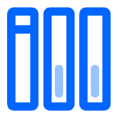

<h1 align="center">  GNote </h1>

Generate your own knowledge base from github.

  
   
  
  
  

## Highlights

- generate static TOC
- support code syntax highlighting
- support Latex formula rendering

## Getting started

## Submitting pull requests

To contribute to the files under the components directory, see [CONTRIBUTING.md](./docs/CONTRIBUTING.md) .

## Release tags

There will be a git tag for each release candidate (RC) and general availability (GA) release. The tag will only point to commits on release branches.
